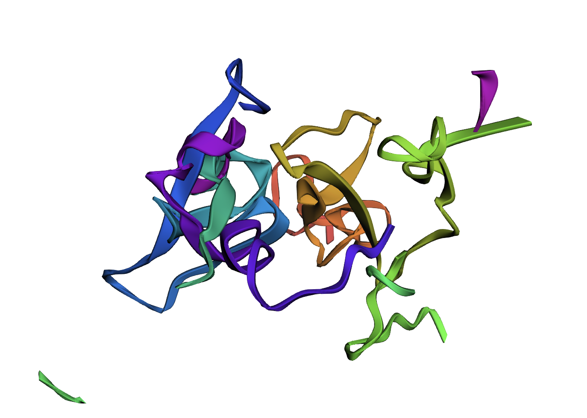
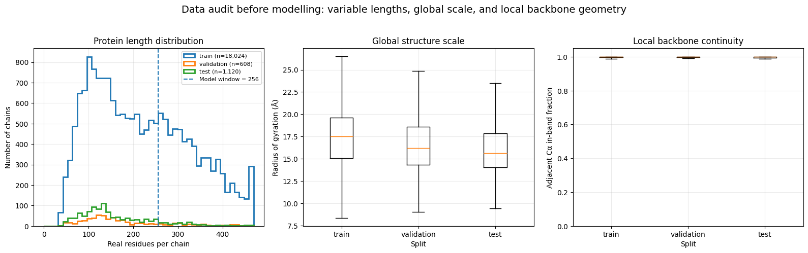
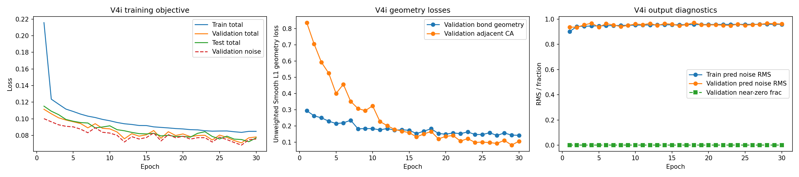
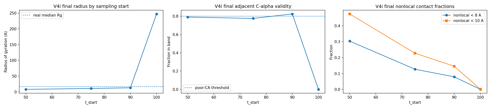
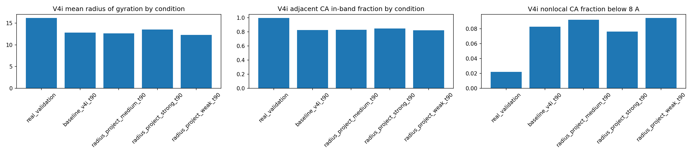
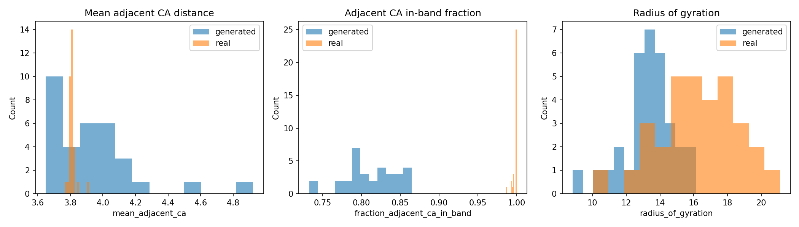
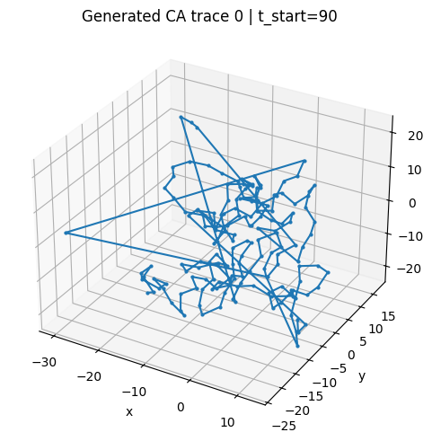
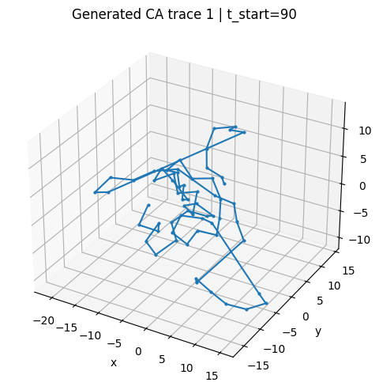
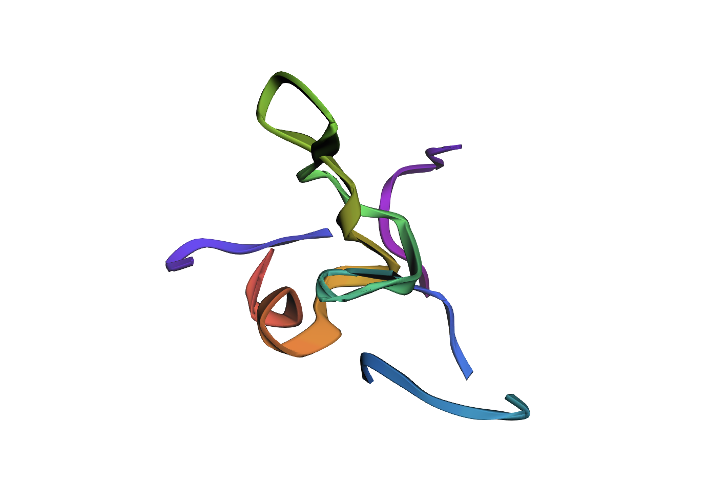
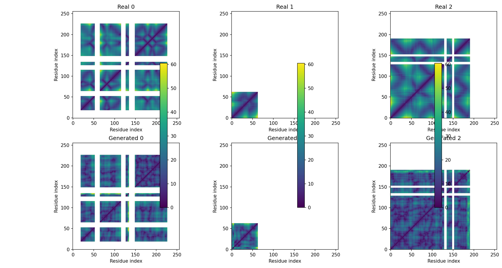

# Protein Backbone Diffusion

A denoising diffusion prototype that generates protein backbone coordinates from pure Gaussian noise.

The model is a coordinate-aware, EGNN-style DDPM denoiser trained on CATH backbone structures. It learns local
backbone geometry well, reaching adjacent Cα spacing of 3.71 Å against a real-data 3.81 Å. The project's most
interesting result is the diagnosis of *why* it initially failed at global geometry: a non-zero terminal
signal-to-noise ratio in the noise schedule was manufacturing structural collapse before the network expressed
any learned preference at all.

This repository is the complete record of that work: fourteen versioned notebooks, the reusable library behind
them, and a 3,000-line development journal written as the work happened.

<p align="center">
  
  <br>
  <em>A backbone sampled from noise by the final model (V4i, t_start = 90, strong projection).</em>
</p>

> **Honest framing up front.** This is a working, carefully evaluated prototype, not a production protein
> generator. The final samples have plausible local backbone continuity and roughly 84% of real global extent,
> but they are not realistic folds. What the repository demonstrates is the full loop of representation,
> objective, sampler, protein-aware evaluation, failure diagnosis, and correction, carried out honestly and
> measured at every step.

---

## Table of contents

- [Headline result](#headline-result)
- [Running it](#running-it)
- [Data availability](#data-availability)
- [The problem](#the-problem)
- [Data and preprocessing](#data-and-preprocessing)
- [Method](#method)
- [The terminal-SNR diagnosis](#the-terminal-snr-diagnosis)
- [Evaluation](#evaluation)
- [Results](#results)
- [The development journal](#the-development-journal)
- [Limitations](#limitations)
- [Future work](#future-work)
- [Repository layout](#repository-layout)
- [References and attribution](#references-and-attribution)

---

## Headline result

The final model is **V4i**: an EGNN-style coordinate-aware DDPM denoiser, trained with a cosine noise
schedule, sampled with a truncated start at `t_start = 90` and a lightweight radius/local-Cα projection during
the reverse trajectory.

All figures are measured on the same 32 validation-shaped masks, so the columns are directly comparable.

| Metric | Real validation | V4g weak projection | V4i baseline `t=90` | **Final V4i strong `t=90`** |
| --- | --- | --- | --- | --- |
| Mean adjacent Cα distance (Å) | 3.810 | 3.680 | 3.834 | **3.707** |
| Adjacent Cα in-band fraction | 0.999 | 0.885 | 0.824 | **0.849** |
| Mean radius of gyration (Å) | 16.21 | 9.54 | 12.81 | **13.56** |
| Collapse count | 0/32 | 2/32 | 0/32 | **0/32** |
| Poor Cα-band count | 0/32 | 3/32 | 7/32 | **1/32** |
| Mean nonlocal Cα distance (Å) | 22.30 | 12.89 | 17.40 | **18.52** |
| Fraction nonlocal Cα pairs < 8 Å | 0.022 | 0.192 | 0.083 | **0.076** |

The final sampler eliminates structural collapse entirely (0/32), cuts poor-backbone-band failures to 1/32,
and closes most of the global-extent gap that dominated every earlier version. It remains short of real
structures on radius of gyration (13.56 Å vs 16.21 Å) and still packs too many nonlocal contacts.

---

## Running it

Everything is designed to run in Colab on a single GPU. Training the final model took roughly 30 epochs on an
A100.

### In Colab (recommended)

Open [`notebooks/protein_backbone_diffusion_v4i.ipynb`](notebooks/protein_backbone_diffusion_v4i.ipynb) in
Colab, set the runtime to a GPU (**Runtime → Change runtime type → A100 or T4**), then run the cells in order.

The first cell bootstraps everything: it clones this repository, installs it, resolves the dataset directory,
and creates the artifact folders. Point it at your data with a single environment variable before running:

```python
import os
os.environ['CATH_DATA_DIR'] = '/content/drive/MyDrive/cath_backbone_data'  # holds the two data files
```

Optional environment variables, all with sensible defaults:

| Variable | Purpose |
| --- | --- |
| `CATH_DATA_DIR` | Directory containing the backbone coordinate dataset. |
| `CATH_LOCAL_CACHE` | Where the notebook caches the dataset (default `/content/cath_backbone_data`). |
| `BACKBONE_DIFFUSION_MOUNT_DRIVE` | `0` to skip the Google Drive mount and write to `results/` locally. |
| `BACKBONE_DIFFUSION_ARTIFACT_BASE_DIR` | Override where figures, tables, and checkpoints are written. |
| `BACKBONE_DIFFUSION_RUN_NAME` | Names the run's artifact subdirectory (default matches the notebook). |

Every training hyperparameter is also exposed as a `BACKBONE_DIFFUSION_*` variable, covering learning rate,
hidden dimension, layer count, geometry-loss weights, and gradient clipping. A variant can therefore be run
without editing a cell. See the config cell near the top of the notebook for the full list.

If the Drive mount times out (this happens in IDE-hosted Colab runtimes), set
`BACKBONE_DIFFUSION_MOUNT_DRIVE=0` and the notebook writes to the repo-local `results/` directory instead.

### Locally

Local installation is useful for the library and tests; training realistically needs a GPU.

```bash
git clone https://github.com/mitsenkov/latent-structure-diffusion.git
cd latent-structure-diffusion
python -m venv .venv
source .venv/bin/activate
pip install -r requirements.txt
pip install -e .
pytest
```

`requirements.txt` covers the data and analysis stack. PyTorch is not pinned there because Colab provides it,
so install it yourself for local training (`pip install torch`), plus `py3dmol` if you want the ribbon renders.

### Which notebook to read

| Notebook | What it shows |
| --- | --- |
| [`cath_dataset_analysis.ipynb`](notebooks/cath_dataset_analysis.ipynb) | The data audit. Runs without a GPU. Start here. |
| `protein_backbone_diffusion_v1.ipynb` | Minimal end-to-end DDPM baseline over flattened coordinates. |
| `protein_backbone_diffusion_v2.ipynb` | The same baseline with distribution-level collapse diagnostics. |
| `protein_backbone_diffusion_v3b.ipynb` | Local geometry losses on the flattened denoiser. |
| `protein_backbone_diffusion_v4.ipynb` | The EGNN-style coordinate-aware denoiser. The architectural turning point. |
| `protein_backbone_diffusion_v4d`–`v4f` | Training-time nonlocal and contact-tail objectives (informative negatives). |
| `protein_backbone_diffusion_v4g.ipynb` | Sampling-time guidance and projection. |
| `protein_backbone_diffusion_v4h.ipynb` | The cosine-schedule correction and its unstable endpoint. |
| **[`protein_backbone_diffusion_v4i.ipynb`](notebooks/protein_backbone_diffusion_v4i.ipynb)** | **The final model.** Truncated-start sampling and the final result. |

Version numbers mark the main modelling direction. Letter suffixes mark smaller experimental variants within
it, such as a changed loss, sampler, projection, or schedule.

---

## Data availability

The training data is not included in this repository. The notebooks are readable and every saved output,
table, and figure is committed, but the training runs are not independently reproducible without the data. To
run them, supply your own CATH backbone coordinate dataset and point `CATH_DATA_DIR` at it.

---

## The problem

Build a generative model that operates directly on protein backbone structures, trains under a diffusion
objective, tracks meaningful held-out metrics, and samples new backbone-like coordinate traces from noise.

Four pieces are needed: a coordinate representation, a denoising objective, a reverse sampling procedure, and
an evaluation strategy that checks *protein-like structure* rather than only machine-learning loss. That last
point turned out to be the one that mattered. Denoising loss is a poor predictor of generated-structure
quality in this setting, and the project repeatedly selected models on structural metrics against the grain of
the loss curve.

The goal was never to reproduce AlphaFold 3, Chroma, RFdiffusion, or BoltzGen. Those use far richer
conditioning and much larger stacks. The aim was to use related ideas at prototype scale: coordinate-aware
denoising, local geometric objectives, nonlocal diagnostics, and sampling-time correction.

---

## Data and preprocessing

Each example carries four backbone atoms per residue (N, Cα, C, and O), held internally as `B × L × 4 × 3`
(batch, residue window, backbone atom, xyz) and flattened per residue to `B × L × 12` for the DDPM interface,
with the residue mask preserved throughout.



*Chain lengths vary widely, motivating the fixed 256-residue window and overlapping training chunks. The
radius-of-gyration distribution is the real-data reference used for every later collapse diagnostic. The
in-band fraction on the right shows that real backbones are essentially perfectly continuous (≈0.999), which
is the bar generated structures are measured against.*

| Split | Chains kept | Training chunks | Median length | Mean length | Truncated fraction |
| --- | --- | --- | --- | --- | --- |
| Train | 18,024 | 27,706 | 204 | 218.7 | 0.412 |
| Validation | 608 | n/a | 146 | 174.2 | 0.217 |
| Test | 1,120 | n/a | 138 | 162.2 | 0.168 |

Decisions worth flagging:

- **Fixed 256-residue window.** Short proteins are padded and masked; long chains are truncated. 41% of
  training chains exceed the window.
- **Overlapping chunks.** Long training chains become 256-residue chunks at stride 128, taking 18,024 chains
  to 27,706 chunks. Validation and test stay at chain level, so held-out evaluation is never chunked.
- **Leakage control.** Parent chain identifiers are tracked so chunks from one chain cannot straddle splits.
- **Split parsing.** The `cath_nodes` mapping in the split file is auxiliary metadata, not a fourth split.
  Letting it overwrite the real assignment was an easy and quiet mistake to make. 96 rows belong to none of
  train, validation, test, or `cath_nodes` and are ignored.
- **Train-only normalisation.** Coordinates are centred and normalised using training statistics alone, and
  the identical transform is applied to validation, test, and generated structures. Generated coordinates are
  denormalised back to Ångström before any structural evaluation.

The clearest weakness here is that chunks are fixed windows over full chains. Splitting by actual CATH domain
assignments would better match the domain-level structure distribution and stop a chunk from straddling two
biologically separate domains.

---

## Method

### Diffusion formulation

Standard DDPM. Clean coordinates `x0` are corrupted by

```
x_t = sqrt(alpha_bar_t) · x0 + sqrt(1 - alpha_bar_t) · epsilon
```

and the model predicts `epsilon` from `x_t` and `t`. The primary objective is masked MSE between predicted and
true noise, with padded residues excluded.

### The denoiser

The final model is `BackboneCoordinateEGNNDenoiser`. Every backbone atom is a graph node carrying atom
identity, residue position, timestep information, coordinates, and mask state. Edges are deliberately sparse:

- **Local backbone edges** for N–Cα, Cα–C, C–O, adjacent C–N, and adjacent Cα–Cα.
- **Sequence-offset Cα edges** at offsets 8 and 16, giving limited nonlocal context without ever building a
  dense all-pairs graph.

One implementation detail mattered more than it looks. Early V4 attempts leaned on EGNN coordinate
displacement alone and produced weak, low-amplitude predictions. Adding an **explicit per-node noise head** off
the hidden state turned the model into a proper DDPM noise predictor and unlocked stable full-data training.

| Setting | Final V4i value |
| --- | --- |
| Model | `BackboneCoordinateEGNNDenoiser` |
| Parameters | 1,864,491 |
| Hidden dimension / layers | 192 / 4 |
| Sparse Cα sequence-offset edges | 8, 16 |
| Timesteps / schedule | 100 / cosine |
| Epochs / batch size | 30 / 32 |
| Optimiser / LR / grad clip | Adam / 1e-3 / 1.0 |
| Device | NVIDIA A100-SXM4-40GB |
| Best validation / test noise loss | 0.0683 (epoch 28) / 0.0724 |

### Geometry-aware losses

Raw noise prediction never tells the model that adjacent residues and covalent backbone atoms sit at
protein-like distances. Lightweight geometry terms on the predicted clean coordinates `x0_pred` supply that,
targeting adjacent Cα–Cα at 3.80 Å, N–Cα at 1.46 Å, Cα–C at 1.53 Å, C–O at 1.23 Å, and the adjacent peptide
C–N at 1.33 Å.

```
total_loss = noise_loss + 0.01 · bond_geometry_loss + 0.01 · adjacent_ca_geometry_loss
```

Smooth L1 with `beta = 0.5`, applied only for `t <= 50` where `x0_pred` is stable enough to supervise. No
radius-of-gyration loss survives into the final objective.

Sparse nonlocal Cα distance losses and contact-tail losses were also tested (V4d–V4f) and are reported below
as informative negatives. They moved compactness metrics but usually damaged local continuity, which is what
pushed the final intervention to sampling time instead.

---

## The terminal-SNR diagnosis

This is the part of the project worth reading closely.

Every version through V4g used 100 timesteps with a standard **linear** beta schedule. With only 100 steps
that leaves `alpha_bar_T = 0.364` at the final timestep, so `sqrt(alpha_bar_T) = 0.603` and terminal SNR is
0.571. **The noisiest training example the model ever saw still retained roughly 60% clean structural signal,
yet sampling starts from pure Gaussian noise, a distribution the model never encountered.**

The mismatch is not merely qualitative; it predicts the collapse quantitatively. Working the epsilon-prediction
arithmetic at the terminal step, the first reverse step reconstructs `x0 ≈ 0.335 · x_T`. The prior noise cloud
has Rg ≈ 20.3 Å, so the first denoised structure already sits at `20.3 × 0.335 ≈ 6.8 Å`. The saved
reverse-trajectory diagnostic starts at **6.46 Å** and only climbs to ~8.2 Å. That agreement is the signature:
roughly half the global collapse was manufactured by the schedule before the network expressed any preference
of its own.

| Schedule / sampler | `alpha_bar_T` | `sqrt(alpha_bar_T)` | Interpretation |
| --- | --- | --- | --- |
| Linear, T=100 (V4g) | 0.3636 | 0.6030 | Noisiest training step still retains strong clean signal. |
| Cosine, T=100 (V4h/V4i) | 2.43e-7 | 0.00049 | Training reaches near-pure noise; the exact endpoint is numerically fragile under epsilon prediction. |
| Final sampler (V4i) | n/a | n/a | `t_start = 90` skips the unstable endpoint while keeping a far less collapsed trajectory. |

V4h applied the correct fix, a cosine schedule, and it improved held-out denoising loss. But full terminal
sampling from `t = 100` became numerically unstable: with `alpha_bar` near zero, `x0` reconstruction is
extremely sensitive to small epsilon errors, and the endpoint produced exploded structures (Rg 145 Å) rather
than plausible backbones.

V4i then asked the controlled question: *can the corrected schedule improve global structure if the unstable
endpoint is skipped?* Yes.

---

## Evaluation

Machine-learning metrics confirm the model learns denoising rather than collapsing to a trivial predictor.
These cover train/validation/test noise loss, timestep-wise diagnostics, predicted-noise RMS, `x0_pred` RMS,
and near-zero prediction fraction.

Structural metrics are treated as **first-class outputs**, because denoising loss did not predict generated
quality:

- Mean adjacent Cα distance and **in-band fraction** (how often adjacent Cα spacing lands in the physical band)
- Backbone bond-length means
- Radius of gyration
- **Collapse count**, meaning samples whose Rg falls below half the real validation median. On the 32-sample
  evaluation set the real median is 16.34 Å, so the threshold is 8.17 Å.
- **Poor Cα-band count**, meaning samples with adjacent Cα in-band fraction below 0.8.
- Nonlocal Cα contact fractions
- Visual inspection

The two count-based metrics are deliberately stricter than looking at means, which can hide a bimodal failure
population entirely.

---

## Results

### The modelling progression

| Model / condition | Val noise loss | Adj. Cα in-band | Rg (Å) | Collapse | Poor Cα-band |
| --- | --- | --- | --- | --- | --- |
| V2 baseline | 0.0975 | 0.265 | 7.15 | 31/32 | 32/32 |
| V3b stable, 100 epochs | 0.0688 | 0.728 | 7.86 | 19/32 | 18/32 |
| V4 reference (EGNN) | 0.0990 | 0.859 | 8.35 | 10/32 | 5/32 |
| V4g weak projection | 0.0970 | 0.885 | 9.54 | 2/32 | 3/32 |
| V4h full terminal cosine | 0.0687 | 0.002 | 145.26 | 0/32 | 32/32 |
| V4i baseline `t=90` | 0.0683 | 0.824 | 12.81 | 0/32 | 7/32 |
| **V4i strong projection `t=90`** | **0.0683** | **0.849** | **13.56** | **0/32** | **1/32** |
| Real validation reference | n/a | 0.999 | 16.21 | 0/32 | 0/32 |

Read the first and third rows together. **V4 has a worse validation noise loss than V3b (0.0990 vs 0.0688) and
dramatically better structures**, with in-band fraction 0.859 vs 0.728 and collapse 10/32 vs 19/32. That
inversion is why structural metrics became the primary model-selection criterion for the rest of the project.

The V4h row is the other one to read carefully: the *best* noise loss in the table paired with the *worst*
possible samples. It is a corrected schedule sampled at an endpoint the sampler cannot handle.

**V1/V2, the baseline and its failure.** A minimal DDPM over flattened coordinates trained and sampled
successfully, but produced compact, locally distorted structures. V2 made this measurable rather than
anecdotal: in-band fraction 0.265, Rg 7.15 Å against a real 16.21 Å, and 31/32 samples classified as collapsed.

**V3b, geometry losses help locally.** An aggressive geometry objective degraded sampling outright. A
stabilised version (lower weights, Smooth L1, timestep gating) trained for 100 epochs lifted the in-band
fraction to 0.728 and cut poor-band failures to 18/32. Global compactness barely moved. Visual inspection was
genuinely useful here, since some samples contain convincing local α-helical turns. The model was learning
local continuity, not global fold extent.

**V4, the architectural turning point.** The EGNN-style denoiser moved mean adjacent Cα from 3.162 Å to
3.740 Å, in-band from 0.728 to 0.859, Rg from 7.86 Å to 8.35 Å, collapse from 19/32 to 10/32, and poor-band
from 18/32 to 5/32. More expensive to train, and clearly worth it.



*Final model training. Best validation noise loss 0.0683 at epoch 28.*

**V4d–V4f, informative negatives.** Sparse nonlocal Cα distance supervision, soft contact-tail loss, and
one-sided excess-contact loss all targeted global compactness at training time. Exact nonlocal distance
matching was learnable but did not transfer to free sampling. Contact-tail losses moved compactness in the
right direction but damaged adjacent Cα continuity. None became the solution, and reporting them as failures
is more useful than hiding them, because they narrowed the hypothesis to something the training objective
could not reach.

**V4g, moving the intervention to sampling time.** The learned denoiser stayed fixed while the reverse
trajectory was lightly projected to discourage collapse and preserve Cα spacing. Weak projection gave the best
balance: Rg 9.54 Å, collapse 2/32, and the highest in-band fraction of any practical sampler at 0.885. Still
far below the real 16.21 Å.

### Choosing the truncation point



| V4i `t_start` | Samples | Rg (Å) | Adj. Cα (Å) | Cα in-band | Collapse | Poor Cα-band |
| --- | --- | --- | --- | --- | --- | --- |
| 100 | 8 | 247.51 | 55.09 | 0.000 | 0/8 | 8/8 |
| **90** | 8 | **12.96** | **3.92** | **0.825** | **0/8** | **2/8** |
| 75 | 8 | 10.79 | 3.89 | 0.776 | 0/8 | 5/8 |
| 50 | 8 | 7.97 | 3.70 | 0.791 | 5/8 | 5/8 |

The trade-off is monotone and legible. `t = 100` explodes. Starting progressively later reintroduces
contraction, and by `t = 50` collapse is back at 5/8. `t_start = 90` sits at the balance point. Note that the
0/8 collapse count at `t = 100` is meaningless: those samples are not compact because they are exploded.

### Final sampler



*Projection conditions at `t_start = 90`. Strong projection gives the best final balance.*

Against V4g weak projection, the final V4i strong projection raises mean Rg from 9.54 Å to 13.56 Å, raises mean
nonlocal Cα distance from 12.89 Å to 18.52 Å, cuts the fraction of nonlocal Cα pairs below 8 Å from 0.192 to
0.076, and cuts poor-band failures from 3/32 to 1/32. Its in-band fraction is *lower*, at 0.849 against 0.885,
and that trade is accepted deliberately. The global scale is far closer to real structures, and a locally
pristine but globally collapsed structure is not the better protein.



*Generated samples against real validation structures. The distributions, not just the means, show where the
remaining gap sits.*

### Visual sample quality

<p align="center">
  
  
  <br>
  
  
  <br>
  <em>Two sampled structures, each as an XYZ Cα trace and a py3Dmol ribbon render.</em>
</p>

Early baselines look like tangled or over-compressed coordinate traces, exactly matching their low Rg and
poor band quality. The V4/V4g/V4i family produces the most coherent local traces, with occasional
secondary-structure-like regions. The renders above should be read as *a partial rescue of global compactness*,
not as realistic folds: the chain is continuous and locally well-formed, and the global topology is not
protein-like.



*Real (top) against generated (bottom) Cα distance maps. The real maps show the block structure and
off-diagonal contacts of genuine folds. The generated maps are diffuse away from the diagonal, which is the
clearest single picture of what the model has and has not learned.*

---

## The development journal

**[`notes/development_journal.md`](notes/development_journal.md), 3,000 lines, written as the work happened.**

I keep a written record from the first commit onward, and I have deliberately published it here rather than
tidying it away. It is not a retrospective narrative. It is the contemporaneous log, covering each version's
motivation, the hypothesis being tested, the saved artifact paths, the numbers as they came back, and the
reasoning for what to try next.

It also contains the things a polished write-up normally deletes:

- The dead ends in full, including the nonlocal and contact-tail experiments and why each failed.
- A **second-opinion review** near the end that reread the saved diagnostics and the code directly, rather
  than the version narrative, and named the terminal-SNR root cause the entire V1–V4g trajectory had missed.
- A **correction to my own record**. The journal had claimed medium projection was the best V4g setting, but
  the saved comparison table actually showed weak was better. That correction is left in place, visible,
  rather than quietly overwritten.

If you want to understand how the project actually went, read the journal rather than this README. This file
is the conclusion; the journal is the evidence.

Planning documents and raw session logs are kept locally and are not published. They are scaffolding, and the
journal is the part with the reasoning in it.

---

## Limitations

- Backbone coordinates only. No side chains, no sequence-conditioned design, no all-atom chemistry.
- Effectively **unconditional** apart from residue mask and length. No conditioning on sequence, secondary
  structure, fold class, topology, or function.
- The final sampler uses truncated-start sampling from `t_start = 90`. This is motivated by the endpoint
  diagnostic, but it is **not a standard terminal DDPM sampler** and should not be presented as one.
- Sampling-time projection is a heuristic, not a learned global structure prior.
- Structures remain globally imperfect: 13.56 Å vs 16.21 Å mean Rg, with nonlocal short-contact fractions
  still well above real.
- **No novelty or diversity benchmarking.** The model has not been checked for nearest-neighbour similarity
  against the training set using structural alignment, so memorisation has not been ruled out.
- Chunking is practical but not domain-aware. CATH domain-level splitting would be better for multi-domain
  proteins.

---

## Future work

The priority is global and nonlocal structure, without giving back the local gains.

1. **A stable parameterisation for the near-zero-SNR endpoint**, such as v-prediction or a sampler designed
   for the corrected schedule. This directly tests whether V4i can use the full `t = 100` endpoint without
   exploding.
2. **A low-noise distogram / pairwise Cα distance objective**, applied only where `x0_pred` is reliable. Far
   more informative than a scalar radius penalty, and it does not force every structure toward one generic Rg.
3. **Self-conditioning**, so the model can use its previous `x0` prediction to stabilise global geometry across
   denoising steps.
4. **A better structural prior**, built from spatial neighbour edges, local frames, torsion/internal
   coordinates, or a correlated polymer prior instead of isotropic Gaussian noise.

On the evaluation side: nearest-neighbour structural search, diversity analysis, TM-score-style comparison, and
proper stereochemical checks. These are what would separate genuinely novel protein-like structures from
memorised or invalid coordinate traces. Until they exist, claims about sample quality here stay modest.

---

## Repository layout

```text
notebooks/                          Fourteen versioned notebooks, V1 through V4i, plus the data audit.
src/latent_structure_generation/
  backbone_diffusion.py             Schedules, q_sample, denoisers, losses, samplers, dataset, metrics.
  geometry.py                       Distance matrices, radius of gyration, bend angles, dihedrals.
  metrics.py                        Cα validation summaries and metric tables.
  graphs.py                         kNN and sequential edge construction.
  io.py                             Structure-file parsing and atom tables.
  plots.py                          Distance-matrix and Cα-trace plotting.
tests/                              Tests for the core geometry functions.
notes/development_journal.md        The full development log.
reports/                            Decision log and validation report template.
docs/figures/                       Figures used in this README.
data/raw/, data/processed/          Local or Colab-only input data. Not tracked.
results/                            Run artifacts such as figures, tables, and checkpoints. Not tracked.
```

---

## References and attribution

Conceptual references:

- Ho et al., *Denoising Diffusion Probabilistic Models*, 2020.
- Satorras et al., *E(n) Equivariant Graph Neural Networks*, 2021.
- Nichol and Dhariwal, *Improved Denoising Diffusion Probabilistic Models*, 2021.
- Lin et al., *Common Diffusion Noise Schedules and Sample Steps are Flawed*, 2023. This is the paper behind
  the terminal-SNR diagnosis above.

Standard diffusion components follow common public DDPM patterns, including sinusoidal timestep embeddings,
forward noising, epsilon prediction, reverse DDPM sampling, and cosine schedules. No external repository was
copied wholesale. I read public EGNN resources, including `lucidrains/egnn-pytorch`, to understand the usual
implementation patterns for coordinate-aware message passing. The denoiser here was then written for the
backbone-coordinate setting, with its own residue/atom representation, sparse backbone and sequence-offset
edges, timestep conditioning, masking, diffusion losses, sampling diagnostics, and protein-structure metrics.
All data handling, chunking, metrics, and evaluation code is original to this project.

This work was developed with the assistance of AI coding tools for implementation support, debugging,
refactoring, and rapid iteration in the notebooks. I made the modelling choices, covering representation,
failure interpretation, evaluation metrics, and which experiments to carry forward, and I take responsibility
for the final implementation, results, limitations, and interpretation.

Licensed under the [MIT License](LICENSE).
